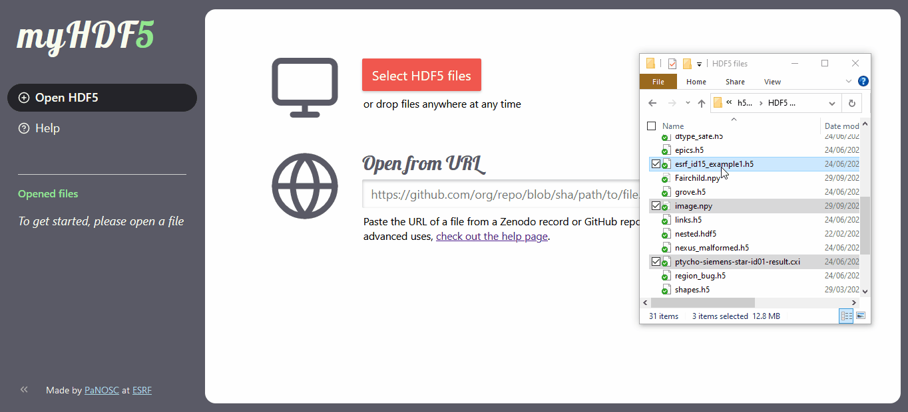

# myHDF5

myHDF5 is a **free online service to explore and visualize HDF5 files**.

Users can choose to select files from their local machine, or to load files that
are hosted remotely on platforms such as GitHub or Zenodo.

myHDF5 is based on [H5Web](https://github.com/silx-kit/h5web), an HDF5 file
viewer and visualisation component library built with React and WebGL, as well
as [h5wasm](https://github.com/usnistgov/h5wasm), a WebAssembly-powered library
for reading HDF5 files from JavaScript.

